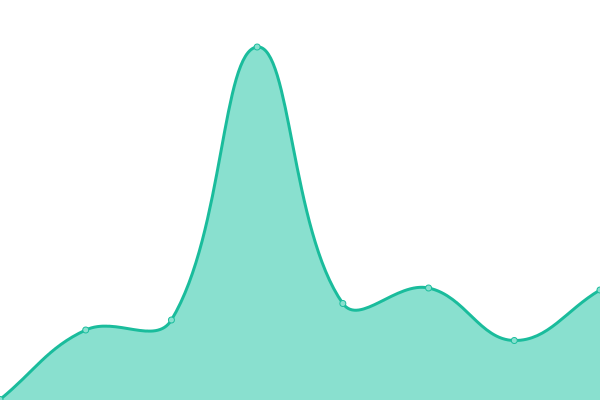
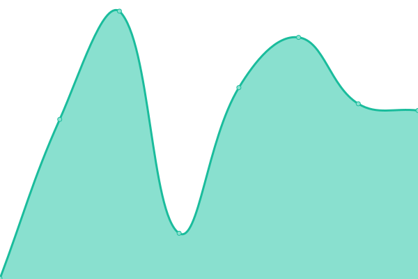

# [📈 Live Status](https://status.clipdrop.co): <!--live status--> **🟩 All systems operational**

This repository contains the open-source uptime monitor and status page for [Hugggsy](https://status.clipdrop.co), powered by [Upptime](https://github.com/upptime/upptime).

With [Upptime](https://upptime.js.org), you can get your own unlimited and free uptime monitor and status page, powered entirely by a GitHub repository. We use [Issues](https://github.com/Hugggsy/clipdrop-upptime/issues) as incident reports, [Actions](https://github.com/Hugggsy/clipdrop-upptime/actions) as uptime monitors, and [Pages](https://status.clipdrop.co) for the status page.

<!--start: status pages-->
<!-- This summary is generated by Upptime (https://github.com/upptime/upptime) -->
<!-- Do not edit this manually, your changes will be overwritten -->
<!-- prettier-ignore -->
| URL | Status | History | Response Time | Uptime |
| --- | ------ | ------- | ------------- | ------ |
|  [Clipdrop web home page](https://clipdrop.co) | 🟩 Up | [clipdrop-web-home-page.yml](https://github.com/initml/clipdrop-upptime/commits/HEAD/history/clipdrop-web-home-page.yml) | 

 159ms
     
 | 

<a href="https://status.clipdrop.co/history/clipdrop-web-home-page">100.00%</a>
    

|  [Clipdrop web remove background tool](https://clipdrop.co/remove-background) | 🟩 Up | [clipdrop-web-remove-background-tool.yml](https://github.com/initml/clipdrop-upptime/commits/HEAD/history/clipdrop-web-remove-background-tool.yml) | 

 98ms
     
 | 

<a href="https://status.clipdrop.co/history/clipdrop-web-remove-background-tool">100.00%</a>
    

|  [Clipdrop web image upscaler tool](https://clipdrop.co/image-upscaler) | 🟩 Up | [clipdrop-web-image-upscaler-tool.yml](https://github.com/initml/clipdrop-upptime/commits/HEAD/history/clipdrop-web-image-upscaler-tool.yml) | 

 78ms
     
 | 

<a href="https://status.clipdrop.co/history/clipdrop-web-image-upscaler-tool">100.00%</a>
    

|  [Clipdrop web cleanup](https://cleanup.pictures) | 🟩 Up | [clipdrop-web-cleanup.yml](https://github.com/initml/clipdrop-upptime/commits/HEAD/history/clipdrop-web-cleanup.yml) | 

 267ms
     
 | 

<a href="https://status.clipdrop.co/history/clipdrop-web-cleanup">100.00%</a>
    

|  Remove background API v1 | 🟩 Up | [remove-background-api-v1.yml](https://github.com/initml/clipdrop-upptime/commits/HEAD/history/remove-background-api-v1.yml) | 

 211ms
     
 | 

<a href="https://status.clipdrop.co/history/remove-background-api-v1">100.00%</a>
    

|  Cleanup API v1 | 🟩 Up | [cleanup-api-v1.yml](https://github.com/initml/clipdrop-upptime/commits/HEAD/history/cleanup-api-v1.yml) | 

 131ms
     
 | 

<a href="https://status.clipdrop.co/history/cleanup-api-v1">100.00%</a>
    

|  Super resolution API v1 | 🟩 Up | [super-resolution-api-v1.yml](https://github.com/initml/clipdrop-upptime/commits/HEAD/history/super-resolution-api-v1.yml) | 

 131ms
     
 | 

<a href="https://status.clipdrop.co/history/super-resolution-api-v1">100.00%</a>
    

<!--end: status pages-->

[**Visit our status website →**](https://status.clipdrop.co)

## 📄 License

- Powered by: [Upptime](https://github.com/upptime/upptime)
- Code: [MIT](./LICENSE) © [Hugggsy](https://status.clipdrop.co)
- Data in the `./history` directory: [Open Database License](https://opendatacommons.org/licenses/odbl/1-0/)
